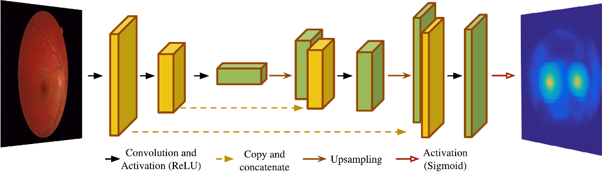
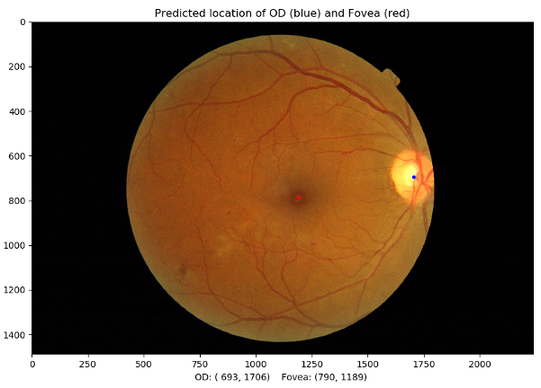

# Joint Retinal Optical Disc and Fovea Detection

Here you can find the implementation of a new strategy for the task of simultaneously locating the optic disc and the 
fovea in eye fundus images. This method has been accepted for publication in MICCAI 2018. If you find this code useful 
for your research, please consider citing our paper:

> Meyer M.I., Galdran A., Mendonça A.M., Campilho A.. A Pixel-Wise Distance Regression Approach for Joint Retinal Optical Disc and Fovea Detection. In: Medical Image Computing and Computer Assisted Intervention – MICCAI 2018, LNCS, vol 11071, pp 39-47, 2018. doi:10.1007/978-3-030-00934-2_5


Introduction
------------
In contrast with previous techniques, the proposed method does not attempt to directly detect only OD and fovea centers. 
Instead, the distance to both locations is regressed for every pixel in a retinal image. 
This regression problem can be solved by means of a Fully-Convolutional Neural Network. 
This strategy poses a multi-task-like problem, on which information of every pixel contributes to generate a globally 
consistent prediction map where likelihood of OD and fovea locations are maximized.

In particular, we make use of the a U-net architecture, while using a loss function suitable to perform pixel-wise 
distance regression (L2 Loss).



Installation 
------------
To install all the requirements to run this code, first clone this repository to your local machine:
```
git clone https://github.com/minesmeyer/od-fovea-regression.git .
```

If you have an Anaconda installation, you can use the `conda` package manager as follows:
```
conda create --name env_name --file requirements.txt
```
where `env_name` is the name you want to use for creating a `conda` environment.

Training 
--------

The method was trained and validated on the Messidor dataset. If you wish to replicate the training, the first step is 
to exclude the Messidor images that do not contain OD and Fovea location information, as provided by [1] 
(http://www.uhu.es/retinopathy/eng/bd.php).

Split the remaining 1136 images in two (*half_1* and *half_2*) and train your model in two different splits:
* **Split 1** will use *half_1*  for training and *half_2* for testing.
* **Split 2** will use *half_2* for training and *half_1* for testing.

To start training, run the `script-train-messidor.py` file, specifying which split is being used and the directory where you wish 
to save the model's weights.

Evaluating
----------

To obtain the resulting predictions on Messidor, use the `predict_od_fov.py` file, specifying which split is being used 
and the directory holding the weights of the model:


Predicting OD and Fovea Location on a Single Image
------------------------

The pre-trained weights of the model are in the file `best_weights.h5`. Please be aware that this model was trained on 
a particular random split of the data as specified above. If you use it on a Messidor subset without re-training, some of 
the images may belong to the original training set. The example image in the `images/` folder is from the test set of the 
particular split this model was trained on.

You can run the `demo.py` script, which takes a retinal image and returns the location of the OD and Fovea:
```
python demo.py --img_dir images/messidor_test.tif --mask_dir images/messidor_test_mask.tif
```
This script saves an image to a `results/` folder, which will be created automatically if it does not exist.

##### NOTE:
When possible, input images should be cropped around the FOV, or a mask of the FOV provided as specified above. 
If no FOV mask is provided, this implementation will still return optic disc and fovea locations, although results may 
be suboptimal. 

Alternatively, you can call the above script with the flag `--estimate_fov`, which will perform a FOV 
segmentation based on a simple thresholding:
```
python demo.py --img_dir images/messidor_test.tif --estimate_fov
```
.



---------------------------------- 

 
--------
    
### References
1.  Gegundez-Arias, M.E., Marin, D., Bravo, J.M., Suero, A.: Locating the fovea
center position in digital fundus images using thresholding and feature extraction 
techniques. Computerized Medical Imaging and Graphics 37, 386–393 (2013)

    
